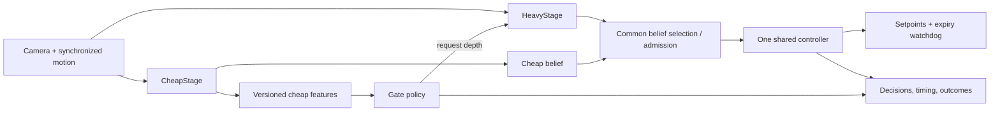

# Adaptive perception obstacle avoidance — project plan

Updated: 2026-09-10. Maintainer: Saurabh. Prepared by Codex for shared work
with Claude and collaborators. Source baseline: `5076902`, plus the preserved
mixed-world test checkpoint. This document records evidence and proposes the
remaining work; writing a task here does not start a flight or experiment.

## 1. Goal and present position

Build a monocular drone navigation system that runs inexpensive perception
continuously and invokes learned depth when the extra information is useful.
The research question is whether a learned gate improves the safety/compute
tradeoff compared with periodic depth calls at a matched measured budget.

We have a working simulator, cheap and heavy perception implementations,
controller variants, recordings, plotting, and historical offline gate work.
Cheap-only avoidance of one large box has been demonstrated in three corrected
flights. Reliable dense-scene navigation and the learned gate's closed-loop
benefit have **not** been demonstrated.

We can build datasets, train a small gate, and verify scheduling on the laptop.
A collaborator can benchmark depth and validate heavy-only flight on a GPU in
parallel. Neither effort should wait for the other to begin. However, a final
claim that deferring improves navigation requires both to work together.

Read [GETTING_STARTED.md](GETTING_STARTED.md) for setup, this plan for direction,
[docs/TASKS.md](docs/TASKS.md) for assignments, and the linked handoffs for evidence.
The [original design reference](docs/reference/project_complete_reference.md)
is historical context, not a current implementation checklist. Its novelty
claims, suggested thresholds, and GPU speed estimates need independent
verification; they are not accepted results in this plan.

## 2. What has been built

| Area | Existing implementation | What remains uncertain or incomplete |
|---|---|---|
| Simulation | ROS 2 Humble, Gazebo Harmonic, ArduPilot SITL, MAVROS; original zones A–D and isolated basic-box world | Portable setup and dependencies need a clean-machine reproduction |
| Startup/lifecycle | Bounded startup/takeoff, landing/disarm, owned-process cleanup; patched MAVROS duplicate-ACK crash | Occasional startup timeouts still occur; preserve them as operational failures |
| Camera and logging | Live sectors/scores, tracks and detection bounds; raw/annotated AVI, frame timestamps, odometry, command/result logs | Current demos need an explicit adapter/manifest for training replay; AVI playback rate is not capture-time rate |
| CheapStage | De-rotated LK flow; explicit invalid sectors/NaNs; current 11-sector, 168-feature pipeline | Low texture, rotation, and absent motion limit flow; relative scores do not certify free space |
| Cheap visible variant | Balanced corner tracking; closed contours and upright edges; separate angular obstacle spans | Edge grouping can join different objects; single-edge side inference and expiring memory are limited |
| HeavyStage | Metric outdoor Depth Anything V2, geometry-derived image band, shared belief output; heavy demo CLI | Explicit device selection/benchmarking and useful-rate dense-scene flight are pending |
| Control | Shared SectorController with baseline/pathtrack variants; world-bearing targets; yaw limiting and route recovery | Reliable gap choice, clearance, and common cheap/heavy admission behavior remain open |
| Runtime watchdogs | Separate command republisher, steady-clock command expiry and stale-result rejection | Gate scheduling must preserve these protections when depth is slow |
| Offline gate | Logistic regression, historical risk labels, whole-run validation; 168-feature recording tools also exist | Legacy 54-feature loader and current features are incompatible without versioning; no validated current runtime artifact |
| Evaluation | Trajectory/time-series plots, endpoint checks, collision footprint checks, per-run metadata | Rotated boxes, vertical geometry, stalled missions, and matched-budget aggregation need work |
| Collaboration | Package-local Git, AGENTS/CLAUDE instructions, advisory edit lock, task board and handoffs | Review is task-specific; many Codex implementation changes still await peer review |

Code entry points: `obst_avoidance/perception/`, `control/`, `runtime/`,
`platform/vehicle.py`, `autonomous_demo.py`, and `tools/gate_*.py`.
The runtime gate interface and six-policy integration are still planned work;
the presence of offline training scripts does not mean they are integrated.

## 3. Evidence so far

| Experiment | Observed outcome | Interpretation |
|---|---|---|
| Corrected basic box, centered start | Endpoint reached; no collision reported; landed/disarmed; minimum sampled modeled margin 0.249 m | Demonstrated basic avoidance at maximum 0.5 m/s |
| Same box, y=-0.7 m | Endpoint reached; margin 0.521 m; landed/disarmed | Chose the other side successfully |
| Same box, y=+0.7 m | Endpoint reached; margin 0.537 m; landed/disarmed | Third successful corrected flight |
| Earlier basic-box attempt | Collision after losing clipped outlines | Preserved failure; corrected with upright edges and short angular memory |
| Separate basic offset startup | GUIDED confirmation timeout before takeoff; disarmed | Startup failure, not an avoidance trial |
| Original Zone A, y=-3.8 m | Endpoint reached and landed; existing evaluator reports no collision but only 0.014 m minimum margin | Skimmed the box; not robust clearance |
| Zone A geometry audit | Rotated-box XY footprint gives -0.091 m margin near boxA1 | Safety footprint overlap; actual altitude ~3.37 m was above the 3 m box, so this does not establish physical contact |
| Dense Zone C, y=0 | Stopped near (84.95,1.75); no endpoint completion; user stopped test; landed/disarmed | Gap-selection deadlock; LK could be 11/11 valid while controller commanded zero |
| HeavyStage on laptop | Reported live inference about 4–5 seconds/frame, roughly 0.2–0.25 FPS | Too slow for the intended moving closed-loop configuration; not 5 FPS |
| Heavy + pathtrack_v5 CPU attempt | Reported perception timeout before a usable control frame | Slow depth and runtime timing must be evaluated together |
| Heavy + pathtrack_v3 CPU attempt | User stopped the slow run | No successful dense-scene heavy-only result |
| Offline tests | 137 distinct tests passed at the basic-box milestone; package build passed | Historical verification of specified modules, not a fresh full-suite result or flight reliability estimate |
| Historical gate classification | Reported leave-one-run-out AUC about 0.90 on the legacy dataset | Not validation of today's features/controller or proof that depth helps |

Evidence:

- [Basic-box implementation and tests](docs/handoffs/2026-09-09-codex-cheap-basic.md)
- [Mixed-world results and shutdown](docs/handoffs/2026-09-10-codex-cheap-multi-stop.md)
- [Claude heavy-stage trial](docs/handoffs/2026-09-09-claude-heavy-ctrl-test.md)
- [MAVROS crash investigation](docs/handoffs/2026-09-06-codex-mavros-crash.md)
- [Controller drift diagnosis](docs/handoffs/2026-09-07-codex-drift-diagnosis.md)

Artifacts are outside the package, under `/home/saurabh/ardu_ws/eval_results/`:
`cheap_basic_center_jr85nV`, `cheap_basic_center_v2_wgShJe`,
`cheap_basic_offsets_v2_4q1AzA`, `cheap_basic_offsets_retry_danjmv`, and
`cheap_multi_QKvtug`. Keep their source hashes, configurations and failed runs.
They are not included in a normal Git checkout. Last shutdown verified project
simulator/controller processes stopped and relevant ports free; that describes
that checkpoint, not a perpetual guarantee about a machine.

## 4. Architecture to finish

Runtime gate inputs must be available before paying for depth: cheap features
and explicitly versioned permitted state only. Ground truth, future frames,
and the current heavy result are labels/analysis inputs, never gate inputs.

The successful `cheap_visible` policy requires silhouette spans. HeavyStage
currently does not supply them, and the CLI explicitly rejects heavy plus
cheap_visible. Do not simply switch that demo to depth and call it a fair
comparison. Establish a shared controller/admission contract first. Either
carry cheap detections consistently alongside either belief or use a common
controller compatible with both; validate and freeze that choice before
comparing gates. Do not compare different controllers or speeds across arms.

Depth-only is a reference condition, not an assumed safety ceiling. Depth
errors and controller deadlocks can still cause failure.

## 5. Ordered work plan and acceptance criteria

These are proposed work packages. Suggested roles are not active assignments.
The task board remains the place to claim work and record review.

| Priority / ID | Work and deliverable | Acceptance evidence | Best location |
|---|---|---|---|
| P0 — EVAL-GEOMETRY | Common evaluator and label geometry using SDF box yaw; explicitly define vertical overlap and modeled airframe dimensions | Corner/rotation/altitude cases checked; old Zone A discrepancy reproduced; evaluator changes versioned and old results retained | Laptop |
| P0 — GATE-001 | Named schemas for legacy 54/5-sector, historical 102/11-sector, current 168/11-sector and applicable 84/5-sector data | Ordered names, preprocessing and perception version in manifests; incompatible inputs rejected; old loaders regression-tested | Laptop |
| P0 — DEVICE-001 | Explicit CPU/CUDA selection and a standalone heavy benchmark | Fail clearly if requested device unavailable; warmup and measured latency separated; checkpoint/device/dtype/input size recorded | Laptop implementation + GPU execution |
| P1 — CTRL-COMMON | Compatible controller/admission contract and separate perception-failure versus no-gap telemetry | Both stages drive the same controller; reproduce Zone C deadlock; validate on box, sparse trees, then cluster; preserve basic-box regressions | Laptop + GPU flights |
| P1 — DATA-001 | Recording adapter, timestamp/feature alignment, labels and dataset manifest | RGB, intrinsics, motion, features and outcomes map by frame identity; incomplete horizons handled; geometry labels audited | Laptop |
| P1 — GATE-002 | Never-heavy, always-heavy, periodic, seeded-random, heuristic and learned policies behind one interface | Resettable/deterministic behavior; serialized model includes schema, preprocessing, threshold and provenance | Laptop |
| P1 — RUNTIME-001 | Gate-to-depth scheduling, common belief routing, logs and replay EOF handling | Stubbed heavy tests cover normal, slow, stale, failed and missing results; no expired result restarts stale motion | Laptop |
| P2 — TRAIN-001 | Current-schema data collection and provisional/final gate artifacts | Whole-run/held-out-zone validation; leakage audit; threshold chosen on validation only; final test set untouched | Laptop; optional offline depth on GPU |
| P2 — HEAVY-VALIDATE | Recorded-frame depth audit followed by heavy-only simulation on target hardware | Actual obstacle range/coverage checks and goal/collision/deadlock results in basic, sparse and dense scenes | GPU collaborator |
| P2 — EVAL-001 | Resumable six-arm runner and derived comparison tables | Common configuration except gate; paired scenario seeds; actual heavy calls and latency logged; failed runs retained | Laptop harness + GPU execution |
| P2 — SETUP-001 | Portable setup and collaborator package | Clean-machine no-flight smoke test, exact versions/checkpoint, explicit simulation ownership and independent run recipes | Both |
| P3 — GPU-001 | Frozen-protocol closed-loop comparison | Confidence intervals and all outcomes reported; budget matching verified; no claim based on AUC alone | Target GPU machine |

Controller work should address the demonstrated mechanisms: keep distinct
obstacles distinct, maintain a chosen gap/side across short visual losses,
avoid cutting back into the next obstacle, and define bounded behavior when
no direction is admissible. Better depth may help range admission, but it
does not automatically fix a merged-obstacle or route-selection deadlock.

First practical sequence: repair geometry/schema definitions; build device
benchmark and policy interface in parallel; settle the common controller;
then integrate recording/runtime and collect the current training data.
Offline gate prototyping can proceed before GPU availability. Final flight
claims cannot.

## 6. Data and learning plan

Use existing recordings to develop loaders and tests, then collect a versioned
current dataset. Cover empty routes, successful dodges, thin trees, large
plain obstacles, multiple objects, temporary flow loss, goal reorientation,
collisions and no-progress episodes. Include useful negative runs, not only
approaches ending in collision. Record human cancellation separately.

Maintain distinct labels/outcomes:

| Quantity | Purpose |
|---|---|
| Collision within a predeclared capture-time horizon | Initial risk-prediction target; historical horizon is 2 s, not automatically appropriate for every speed/device |
| Perception support/quality failure | Diagnose when cheap information is missing or unreliable |
| No-progress/deadlock | Diagnose control/planning failure even without a collision |
| Endpoint completion and timeout/cancellation reason | Prevent a stationary or prematurely stopped run being treated as successful navigation |
| Evidence of heavy-stage benefit | Determine whether depth supplies actionable information; verify eventual benefit with paired closed-loop trials |

A safe stop is not the same as completion. A user-stopped recording does not
supply an observed future outcome beyond its end; exclude or censor those
horizons. Do not label every deadlock as “depth will fix this.” Initially call
the learned model a **risk gate** if that is what its labels actually teach.
Cheap/heavy disagreement alone is not ground truth. Cached heavy predictions
on the same frames help diagnose complementarity but cannot establish the
counterfactual trajectory after a different command.

Split by whole run, with held-out scenes/zones where feasible. Keep neighboring
frames, duplicate recordings and derived copies in the same split. Fit scaling,
imputation and threshold selection on training/validation data only. Report
class counts, precision/recall, missed-risk rate and realized deferral along
with ROC/PR curves. Export ordered feature names, schema, model weights,
preprocessing, threshold, data/split manifest and source revision.

The new balanced-tracking variant can change feature distributions even when
the vector still has 168 entries. Record the perception algorithm version as
well as feature count; do not silently reuse an old cache or classifier.

## 7. Runtime and timing plan

A small gate is inexpensive to train/run on CPU; it does not make a requested
five-second depth inference arrive sooner. At 0.5 m/s, five seconds corresponds
to 2.5 m of travel if motion continued unchanged. Keep capture time for control
and temporal labels, and steady wall time for operational expiry/performance.

Begin with the documented synchronous routing interface and deterministic
stub/replay tests. For moving GPU trials, measure end-to-end observation age
and reject results too old for the control policy. If asynchronous depth is
introduced, version it explicitly: keep result/frame identity, bound the queue,
allow at most the defined outstanding work, and reject stale completions.
Use identical scheduling semantics across the experimental arms.

Do not make slow CPU flight appear functional merely by extending stale-motion
watchdogs. Offline CPU depth processing is useful and need not meet live control
deadlines. Stop-and-look operation, if investigated, is a separately evaluated
speed/scheduling policy rather than a substitute for the matched moving test.

## 8. GPU collaborator handoff

Send a repository revision, this plan, GETTING_STARTED.md, relevant AGENTS and
handoffs, dependency/model manifests, and a small separately transferred
recording bundle. Confirm license/access requirements for the checkpoint and
include checksums. Remove hardcoded local data paths from runnable tools or
make them explicit configuration. GPU ownership is currently unassigned.

Requested deliverables, in order:

1. Record OS, CPU, GPU/VRAM, driver, CUDA/PyTorch, ROS/Gazebo/ArduPilot/MAVROS
   versions and the exact depth checkpoint. Confirm tensors and model actually
   use the requested device.
2. Run offline warmup and latency/quality checks on our supplied frames; return
   median/p95 latency, input configuration and raw measurements. The guide's
   30–50 ms Jetson estimate is unverified, not an acceptance result.
3. Run the full simulation locally on that machine if possible: first basic
   box, then Zone A, then Zone C, with the agreed compatible controller and
   bounded landing/cleanup. Preserve every attempt.
4. Return config, source/model hashes, frame/result logs, raw/annotated footage,
   trajectories, clearance assumptions, startup errors and final vehicle state.
5. Run the six-arm matrix only after the controller and gate protocol are frozen.

If only a GPU compute environment is available, use it for offline depth/cache
and benchmarking first. Networked live depth is a separate integration task:
network delay belongs in end-to-end latency and must not be treated as a local
GPU result. No undocumented “GPU should fix it” conclusion is acceptable.

## 9. Final evaluation protocol

Compare never-heavy, always-heavy, periodic, seeded random, heuristic and
learned gate using the same world, start/goal, camera, speed policy, controller,
checkpoint, runtime and target hardware. Only gate policy changes. Basic-visible
0.5 m/s demonstrations and historical 0.8 m/s controller runs are separate
experiments, not this comparison matrix.

Use a small pilot to check the harness; then freeze scenarios, seeds, stopping
rules, budgets and the number of final trials before reading final test outcomes.
Choose the sample count to support the uncertainty precision wanted; three box
successes are not a reliability estimate. Pair scenario conditions across arms
without implying identical trajectories. Do not tune on held-out test scenes.

Match periodic/random/heuristic comparisons to the learned gate's validation-set
compute operating point and report actual test-set budget differences. Calls
per decision are useful but not sufficient when decision rates/latency differ;
report measured inference time per mission time or distance too. Use a budget
sweep if a single operating point is misleading. Historical k/p/threshold
values are not current defaults. Claim energy savings only if energy is measured.

Report endpoint completion, collisions, modeled clearance and its geometry,
deadlocks, timeouts, human stops, startup failures, distance/progress, heavy
invocations, decision count, deferral, end-to-end/per-stage mean and p95 latency,
stale-result rejections, cross-track error and meaningful target-side changes.
Separate continuous heading updates from genuine steering reversals.
Include uncertainty intervals, per-scene results and failure videos. A gate
claim requires a better measured safety/compute tradeoff than periodic routing;
if periodic matches it, report that result honestly and reconsider the claim.

## 10. Collaboration and immediate next assignments

| Owner suggestion | First bounded assignment | Review/result to return |
|---|---|---|
| Laptop developer (Codex or Claude) | EVAL-GEOMETRY + GATE-001 | Geometry audit, schema manifest, loader tests; no simulator needed for initial implementation |
| Other developer | DEVICE-001 and/or GATE-002 in a separate checkout | Benchmark CLI or policy/artifact interface plus focused tests |
| GPU collaborator | Hardware manifest and offline benchmark | Actual measurements; then heavy-only validation under the agreed controller |
| Saurabh | Confirm available collaborator/hardware and desired target platform | Hardware constraints and final experiment scope |

Within this shared checkout, use **one writer**: read AGENTS.md, claim the
edit lock, preserve current work, implement, verify, write a handoff and release.
The advisory lock does not coordinate separate machines; use explicit branch/
commit handoffs and transfer artifacts separately there. Parallel collaborators
should own disjoint tasks; do not concurrently run competing stacks on one
machine or assume there is an automatic Claude/Codex chat relay.

The user's latest action authorizes this document. These are next assignments
to choose from, not a request to start all of them now. Simulator work remains
stopped following the user's shutdown request.

## 11. Completion checklist

- [ ] Shared evaluator/labels reflect declared geometry and stopping semantics.
- [ ] Current-schema training and runtime artifacts reject incompatibility.
- [ ] HeavyStage latency and quality measured on the actual target hardware.
- [ ] One controller can use either stage; basic and mixed-scene behavior measured.
- [ ] Six gate policies use common routing, watchdogs, logging and replay semantics.
- [ ] Current data/splits, provisional gate and final held-out evaluation are distinct.
- [ ] Matched-budget closed-loop trials, failures and uncertainty are reproducible.
- [ ] Collaborator can reproduce setup from the manifest and supplied artifacts.
- [ ] Conclusions match measured evidence, including negative results.

The basic-box milestone is complete as a demonstration. The adaptive-gating
research objective remains open until the final comparison supports it.
